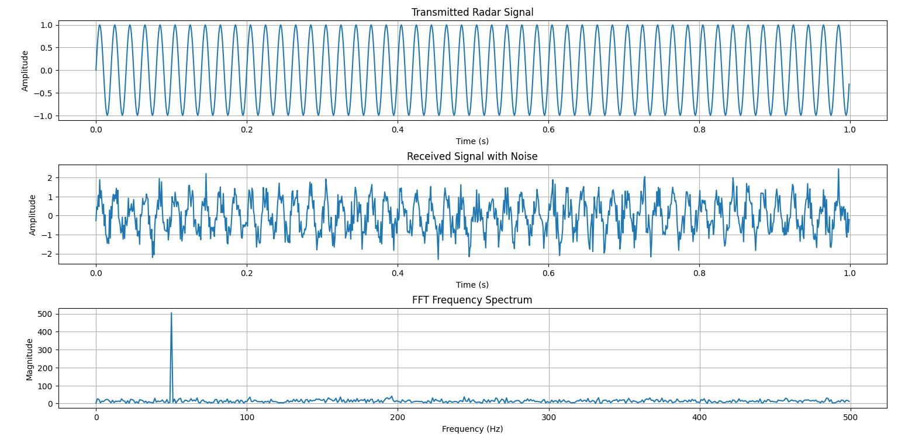

# Radar Signal Detection Using FFT (Simulation)

## Overview

This project demonstrates a basic radar signal processing system using Fast Fourier Transform (FFT) algorithms in Python. The system simulates radar pulse transmission, target reflection, noise addition, and frequency-domain analysis to detect signal peaks and estimate target distance.

The project is designed for understanding Digital Signal Processing (DSP), radar fundamentals, and FFT-based signal detection techniques commonly used in communication systems, automotive radar, and defense applications.

---

# System response

---

# Objectives

- Simulate radar signal transmission and reception
- Implement FFT-based signal analysis
- Detect target signal peaks in frequency spectrum
- Estimate target distance using signal delay
- Analyze noisy radar signals for detection accuracy

---

# Features

- Radar pulse signal generation
- Simulated target reflection
- Noise addition for realistic conditions
- FFT implementation using NumPy
- Peak frequency detection
- Distance estimation
- Time-domain and frequency-domain visualization

---

# Technologies Used

- Python
- NumPy
- Matplotlib

---

# Concepts Used

- Radar Signal Processing
- Fast Fourier Transform (FFT)
- Frequency Spectrum Analysis
- Peak Detection
- Signal Sampling
- Noise Analysis
- Distance Estimation

---

# Project Workflow

1. Generate radar transmitted signal
2. Simulate reflected signal from target
3. Add random noise to received signal
4. Apply FFT to received signal
5. Detect frequency peaks
6. Estimate target distance
7. Plot waveform and FFT spectrum

---

# Mathematical Concepts

## Radar Signal

x(t) = A sin(2πft)

Where:
- A = Amplitude
- f = Frequency
- t = Time

---

## Distance Estimation

d = (c × t) / 2

Where:
- d = Target distance
- c = Speed of light
- t = Signal delay time

---

## FFT Equation

X(k) = Σ x(n)e^(-j2πkn/N)

FFT converts the signal from time domain to frequency domain for easier detection.

---

# File Structure

Radar-FFT-Project/
│
├── radar.py
├── README.md
└── output_images/

---

# Installation

## Step 1: Install Python

Download and install Python:
https://www.python.org/

---

## Step 2: Install Required Libraries

Open terminal or command prompt:

pip install numpy matplotlib

---

# How to Run

Run the Python file using:

python radar_fft.py

---

# Expected Output

The program displays:

- Detected peak frequency
- Peak amplitude
- Estimated target distance

It also generates graphs for:

- Transmitted radar signal
- Received noisy signal
- FFT frequency spectrum

---

# Sample Output

Detected Peak Frequency : 50.00 Hz

Peak Amplitude : 504.96

Estimated Target Distance : 6000000 meters

---

# Applications

- Defense radar systems
- Automotive radar
- Air traffic monitoring
- Drone detection
- Weather radar systems
- Signal intelligence systems

---

# Advantages

- Simple FFT implementation
- Easy visualization of radar signals
- Useful for DSP learning
- Realistic noise simulation
- Low computational complexity using FFT

---

# Limitations

- Basic radar simulation only
- No Doppler velocity estimation
- Limited range resolution
- Sensitive to high noise conditions

---

# Future Improvements

- FMCW radar implementation
- Doppler shift detection
- CFAR target detection
- Real-time signal processing
- FPGA implementation
- SDR (Software Defined Radio) integration

---

# Learning Outcomes

Through this project, the following concepts were learned:

- FFT and spectral analysis
- Radar signal fundamentals
- Digital signal processing
- Noise handling techniques
- Frequency-domain detection methods
- Python-based signal simulation

---

# Conclusion

This project successfully demonstrates radar signal detection using FFT algorithms in Python. The system analyzes noisy radar reflections, detects frequency peaks, and estimates target distance efficiently using frequency-domain signal processing techniques.

---

# Author
Ashish Yadav
Nit Jamshedpur
Radar Signal Detection Using FFT (Simulation)
